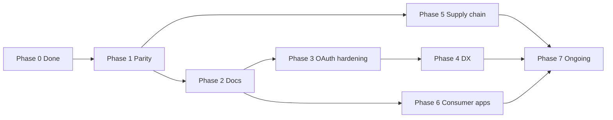

# Remediation Phases — react-native-nitro-google-signin

**Based on:** [run-2 audit](./run-2/REPORT.md) (v1.0.1, 2026-07-11)  
**Status:** Living document — update checkboxes as work completes  
**Scope:** Library maintainers + consumer app teams

---

## Overview

| Phase | Focus | Findings addressed | Effort | Breaking? |
|-------|--------|-------------------|--------|-----------|
| [0](#phase-0--completed-run-1--101) | Already fixed in 1.0.1 | RNGS-003, RNGS-006, RNGS-009 | — | — |
| [1](#phase-1--androidios-parity-quick-wins) | Android/iOS parity | RNGS-015, RNGS-012, RNGS-013 | 1 sprint | Minor behavior change |
| [2](#phase-2--documentation--consumer-guidance) | Docs + trust model | RNGS-001, RNGS-002, RNGS-004, RNGS-010 | 3–5 days | No |
| [3](#phase-3--oauth-config-hardening) | Native config guards | RNGS-001, RNGS-011, RNGS-002 | 1–2 sprints | Optional opt-in API |
| [4](#phase-4--developer-experience) | API polish | RNGS-005, RNGS-007, RNGS-008 | 1 sprint | Possible minor API add |
| [5](#phase-5--supply-chain) | Publish + deps | SC-001 | 2–3 days | No |
| [6](#phase-6--consumer-apps-mandatory) | App/backend | All MEDIUM (defense in depth) | Per app | N/A |
| [7](#phase-7--ongoing) | Continuous | Re-audit, deps | Continuous | No |



---

## Phase 0 — Completed (run-1 → 1.0.1)

| ID | Finding | Fix | Version |
|----|---------|-----|---------|
| RNGS-003 | Android concurrent authorization race | `authorizeMutex.withLock` in `GoogleSignInAuthorizationHelper.kt` | 1.0.1 |
| RNGS-006 | Android `signOut()` / `revokeAccess()` no-ops | `CredentialManager.clearCredentialState` + encrypted storage cleanup | 1.0.1 |
| RNGS-009 | iOS `offlineAccess` ignored | `requestAdditionalScopesWithOfflineAccess` | 1.0.1 |

**No further action** unless regressions are found.

---

## Phase 1 — Android/iOS parity (quick wins)

**Timeline:** Next patch (e.g. 1.0.2)  
**Owner:** Library maintainers  
**Priority:** High — closes real logic gaps with minimal API surface change

### 1.1 — RNGS-015: Session guard on Android `requestScopes()`

**Problem:** iOS requires `currentUser`; Android does not check for an active signed-in session.

**Tasks:**

- [ ] In `GoogleSignInController.requestScopes()`, require `getLastSignedInUserId(context) != null` before calling `authorize()`
- [ ] Throw `GoogleSignInException` with code `SIGN_IN_REQUIRED` (match iOS message semantics)
- [ ] Add unit/integration test: `requestScopes()` without prior sign-in → error

**Files:**

- `android/src/main/java/com/nitrogooglesignin/GoogleSignInController.kt`

**Acceptance criteria:**

- Android behavior matches iOS: no scope request without app sign-in session
- Existing happy path unchanged after successful sign-in

---

### 1.2 — RNGS-012: Fix Android `revokeAccess()` forced logout

**Problem:** `finally { signOut() }` always runs; no validation that `emailOrUniqueId` matches the active user.

**Tasks:**

- [ ] Resolve active user via `getLastSignedInUserId(context)` before revoke
- [ ] Validate `emailOrUniqueId` matches active user's id or email (mirror iOS `HybridNitroGoogleSignin.swift:131-138`)
- [ ] On mismatch: throw `GoogleSignInException` with clear message; **do not** call `signOut()`
- [ ] On successful revoke only: clear storage + `signOut()`
- [ ] On revoke failure: do **not** unconditionally wipe session in `finally` — use explicit success path cleanup

**Files:**

- `android/src/main/java/com/nitrogooglesignin/GoogleSignInController.kt`

**Acceptance criteria:**

- `revokeAccess('wrong@gmail.com')` throws without clearing session
- `revokeAccess(correctUser)` revokes and signs out
- Parity with iOS documented in JSDoc

---

### 1.3 — RNGS-013: Android `clearCachedAccessToken()` ownership check

**Problem:** Android accepts any token string; iOS validates against current user's access token.

**Tasks:**

- [ ] Before `Identity.clearToken()`, require active session (`getLastSignedInUserId`)
- [ ] Call `getTokens()` or read cached access token from last authorization; reject if `accessTokenString` is non-empty and does not match
- [ ] Mirror iOS: empty string may mean "clear current user's cached token"
- [ ] Throw `GoogleSignInException` on mismatch (same message pattern as iOS)

**Files:**

- `android/src/main/java/com/nitrogooglesignin/GoogleSignInController.kt`
- Reference: `ios/HybridNitroGoogleSignin.swift:315-326`

**Acceptance criteria:**

- Clearing another user's leaked token string fails
- Clearing current user's token succeeds

---

### Phase 1 release checklist

- [ ] Update `SECURITY.md` platform notes table if behavior changed
- [ ] Update `skills/react-native-nitro-google-signin/reference.md`
- [ ] Mention fixes in CHANGELOG
- [ ] Re-run audit items RNGS-012, RNGS-013, RNGS-015

---

## Phase 2 — Documentation & consumer guidance

**Timeline:** Parallel with Phase 1 (same release or immediately after)  
**Owner:** Library maintainers  
**Priority:** High — most MEDIUM findings are **documented trust-model** issues; clear docs reduce misuse

### 2.1 — JavaScript trust model (RNGS-001, RNGS-011, RNGS-002)

**Tasks:**

- [ ] Add dedicated doc section: "JavaScript trust model" (any bundle code can call native APIs)
- [ ] Document: `configure()` must be called **once** from app bootstrap — not from lazy-loaded modules or remote config
- [ ] Warn: re-calling `configure()` overwrites OAuth client binding at runtime
- [ ] Document scope allowlisting as **consumer responsibility** with example allowlist helper
- [ ] Link from README → SECURITY.md → `security-audit/`

**Files:**

- `SECURITY.md` (partially done)
- `README.md`
- `skills/react-native-nitro-google-signin/SKILL.md`
- `skills/react-native-nitro-google-signin/reference.md`
- Docs site (`docs/content/` submodule) if applicable

---

### 2.2 — Silent token retrieval (RNGS-004)

**Tasks:**

- [ ] Document iOS: `signIn()` returns cached session / `restorePreviousSignIn` without UI
- [ ] Document Android: `getTokens()` returns cached idToken + fresh accessToken without UI
- [ ] Document: after first sign-in, treat these as **sensitive** — same as storing refresh tokens in JS memory
- [ ] Add threat-model note for apps with many third-party RN dependencies

**Files:**

- `src/GoogleOneTapSignIn.ts` (JSDoc)
- `src/specs/nitro-google-signin.nitro.ts`
- `skills/.../reference.md`

---

### 2.3 — iOS URL scheme hijacking (RNGS-010)

**Tasks:**

- [ ] Document platform limitation: `REVERSED_CLIENT_ID` is a custom URL scheme
- [ ] Note: scheme is extractable from IPA; colliding apps are a known iOS OAuth risk
- [ ] Recommend Universal Links where Google supports them for the app's setup
- [ ] Expo plugin docs: why prefix validation exists, what it does **not** protect against

**Files:**

- `plugin/withNitroGoogleSignIn.js` (comment block)
- README / SECURITY.md

---

### 2.4 — Examples hygiene

**Tasks:**

- [ ] Ensure examples call `configure()` once in app entry (not in screens)
- [ ] Examples: scope allowlist pattern before `requestScopes()`
- [ ] Examples: do not log full tokens (already truncated — verify)

**Files:**

- `example/App.tsx`
- `example-expo/App.tsx`

---

### Phase 2 acceptance criteria

- New integrator can answer: "What happens if I call configure twice?" and "Is signIn silent?"
- SECURITY.md links to [REMEDIATION-PHASES.md](./REMEDIATION-PHASES.md) and [run-2 REPORT](./run-2/REPORT.md)

---

## Phase 3 — OAuth config hardening

**Timeline:** Next minor (e.g. 1.1.0)  
**Owner:** Library maintainers  
**Priority:** Medium — reduces impact of compromised JS; may need new optional API

### 3.1 — RNGS-011: Enforce configure-once (opt-in or release-only)

**Options (pick one or combine):**

| Option | Behavior | Breaking? |
|--------|----------|-----------|
| **A. Strict (default in 2.0)** | Second `configure()` throws `ALREADY_CONFIGURED` | Yes for apps that re-configure |
| **B. Opt-in strict** | `configure({ ..., lockConfiguration: true })` — subsequent calls throw | No |
| **C. Release-only** | `#ifdef` / `BuildConfig.DEBUG` — strict in release, warn in debug | No |

**Recommended:** **B** for 1.x, deprecate re-configure for 2.0.

**Tasks:**

- [ ] Add `lockConfiguration?: boolean` to `OneTapConfigureParams` (Nitro spec + native)
- [ ] When locked, ignore or throw on second `configure()`
- [ ] Log one warning in debug on duplicate configure when not locked

**Files:**

- `src/specs/nitro-google-signin.nitro.ts`
- `android/.../GoogleSignInController.kt`
- `ios/HybridNitroGoogleSignin.swift`
- Run `bun run codegen`

---

### 3.2 — RNGS-001: Build-time `webClientId` pinning (optional)

**Tasks:**

- [ ] **Android:** Read optional `res/values/google_signin.xml` string `nitro_google_signin_web_client_id`; if set, reject JS `webClientId` that differs (unless debug override)
- [ ] **iOS:** Read optional Info.plist key `NitroGoogleSignInWebClientId`; same validation
- [ ] **Expo plugin:** Optional `webClientId` in plugin config written to native resources at prebuild
- [ ] Document setup for high-assurance apps

**Files:**

- `plugin/withNitroGoogleSignIn.js`
- `GoogleSignInController.kt`, `HybridNitroGoogleSignin.swift`
- Plugin docs

**Acceptance criteria:**

- With pinning enabled, `configure({ webClientId: 'evil...' })` fails before any Google UI
- Without pinning, behavior unchanged (backward compatible)

---

### 3.3 — RNGS-002: Optional native scope allowlist

**Tasks:**

- [ ] Add optional `allowedScopes?: string[]` to configure or Expo plugin config
- [ ] `requestScopes(scopes)` filters to intersection with allowlist; throw or strip disallowed scopes
- [ ] Default: no allowlist (backward compatible)

**Files:**

- Nitro spec, Android, iOS, plugin

**Acceptance criteria:**

- App configures allowlist `['openid','email','profile']`; request for Gmail scope fails without reaching Google UI

---

### Phase 3 release checklist

- [ ] Migration note in CHANGELOG for strict configure / pinning
- [ ] Update agent skill with new options
- [ ] Security audit spot-check RNGS-001, RNGS-011, RNGS-002

---

## Phase 4 — Developer experience

**Timeline:** 1.1.x or 1.2.0  
**Owner:** Library maintainers  
**Priority:** Low — not exploitable alone; improves correctness

### 4.1 — RNGS-005: Nonce exposure for backend verification

**Tasks:**

- [ ] Option A: Add `nonce?: string | null` to `OneTapSuccessData` (hashed value sent to Google)
- [ ] Option B: Return raw server nonce via separate `getConfiguredNonce()` (internal/session only)
- [ ] Document: when auto-nonce is used, backend should either skip nonce check or app must pass explicit `configure({ nonce })` from server
- [ ] Update SECURITY.md nonce section

**Files:**

- `src/specs/nitro-google-signin.nitro.ts`
- Android/iOS success mappers

---

### 4.2 — RNGS-008: Wire `GoogleSignInError` in JS wrapper

**Tasks:**

- [ ] Wrap hybrid calls in `GoogleOneTapSignIn.ts` with try/catch
- [ ] Map native `{ code, message, userInfo }` to `new GoogleSignInError(code, message, userInfo)`
- [ ] Ensure `instanceof GoogleSignInError` works for app code

**Files:**

- `src/GoogleOneTapSignIn.ts`

---

### 4.3 — RNGS-007: Reduce JWT parse fallback surface

**Tasks:**

- [ ] Audit whether `IdTokenClaims.parse` is still needed for `sub`/`email`/`hd` or if SDK fields suffice
- [ ] If redundant, remove parse fallback; rely on `GoogleIdTokenCredential` + backend verification
- [ ] Keep `hd` validation for `hostedDomain` on button flow

**Files:**

- `android/.../IdTokenClaims.kt`
- `GoogleSignInController.kt` (`validateHostedDomain`)

---

## Phase 5 — Supply chain

**Timeline:** Next maintenance window  
**Owner:** Library maintainers  
**Priority:** Low — build-time / maintainer risk

### 5.1 — SC-001: Pin `@expo/config-plugins`

**Tasks:**

- [ ] Pin to tested version in `package.json` (e.g. `"@expo/config-plugins": "^10.0.0"` with lockfile in repo)
- [ ] Evaluate moving to `peerDependencies` + `peerDependenciesMeta.optional: true` for Expo
- [ ] Replace `@expo/config-plugins/build/utils/generateCode` with public API if available
- [ ] Document bare-RN apps: Expo plugin dep is unused at runtime

**Files:**

- `package.json`
- `plugin/withNitroGoogleSignIn.js`

---

### 5.2 — Publish pipeline hardening

**Tasks:**

- [ ] Migrate from `NPM_TOKEN` to [npm Trusted Publishing](https://docs.npmjs.com/trusted-publishers) (OIDC)
- [ ] Gate `workflow_dispatch` on protected GitHub Environment
- [ ] Pin CI action SHAs or use dependabot-monitored tags consistently
- [ ] Pin `bun-version` in publish workflow (not `latest`)

**Files:**

- `.github/workflows/publish.yml`

---

## Phase 6 — Consumer apps (mandatory)

**Timeline:** Before production — **every app using this library**  
**Owner:** App teams  
**Priority:** Critical for app security (library cannot replace backend trust)

These do **not** require library code changes but **must** be done to mitigate MEDIUM findings.

### Checklist

- [ ] **6.1 Backend JWT verification** — sig, `aud`, `iss`, `exp`, optional `nonce`, optional `hd`
- [ ] **6.2 `configure()` once** — bootstrap only; build-time `webClientId`; no remote config without signing
- [ ] **6.3 Scope allowlist** — wrap `requestScopes()` in app-level allowed set
- [ ] **6.4 Token hygiene** — do not log `idToken` / `serverAuthCode` / `accessToken` in analytics or crash reporters
- [ ] **6.5 Dependency audit** — review npm packages that could call `GoogleOneTapSignIn.*`
- [ ] **6.6 Logout flow** — call `signOut()` / `revokeAccess()` on account switch
- [ ] **6.7 iOS** — implement `GIDSignIn.sharedInstance.handle(url)` in AppDelegate

**Reference:** [SECURITY.md](../SECURITY.md) backend checklist

---

## Phase 7 — Ongoing

| Task | Cadence | Owner |
|------|---------|-------|
| Dependabot / OSV review (`credentials`, `play-services-auth`, `GoogleSignIn` pod) | Weekly | Maintainers |
| Re-run security audit after major native SDK or API changes | Per major release | Maintainers |
| Integration tests: configure-once, requestScopes guard, revokeAccess parity | After Phase 1 | Maintainers |
| Review audit `findings.json` vs codebase | Quarterly | Maintainers |

---

## Finding → phase map

| ID | Severity | Phase | Status |
|----|----------|-------|--------|
| RNGS-003 | — | 0 | ✅ Fixed 1.0.1 |
| RNGS-006 | — | 0 | ✅ Fixed 1.0.1 |
| RNGS-009 | — | 0 | ✅ Fixed 1.0.1 |
| RNGS-015 | MEDIUM | 1 | ⬜ Todo |
| RNGS-012 | MEDIUM | 1 | ⬜ Todo |
| RNGS-013 | LOW | 1 | ⬜ Todo |
| RNGS-001 | MEDIUM | 2 + 3 | ⬜ Docs / optional pinning |
| RNGS-011 | MEDIUM | 2 + 3 | ⬜ Docs / configure-once |
| RNGS-002 | MEDIUM | 2 + 3 | ⬜ Docs / optional allowlist |
| RNGS-004 | MEDIUM | 2 + 6 | ⬜ Document + consumer |
| RNGS-010 | LOW | 2 | ⬜ Document |
| RNGS-005 | LOW | 4 | ⬜ Todo |
| RNGS-007 | LOW | 4 | ⬜ Todo |
| RNGS-008 | LOW | 4 | ⬜ Todo |
| SC-001 | LOW | 5 | ⬜ Todo |

---

## Progress tracker

| Phase | Status | Target | Release |
|-------|--------|--------|---------|
| 0 — Completed | ✅ Done | — | 1.0.1 |
| 1 — Android/iOS parity | ⬜ Not started | — | 1.0.2 |
| 2 — Documentation | 🟡 Partial (SECURITY.md) | — | 1.0.2 |
| 3 — OAuth hardening | ⬜ Not started | — | 1.1.0 |
| 4 — DX | ⬜ Not started | — | 1.1.x |
| 5 — Supply chain | ⬜ Not started | — | — |
| 6 — Consumer apps | ⬜ Per-app | — | — |
| 7 — Ongoing | 🟡 Dependabot active | — | — |

---

## Suggested release plan

```
1.0.2  →  Phase 1 (parity fixes) + Phase 2 (docs)
1.1.0  →  Phase 3 (lockConfiguration, optional pinning/allowlist)
1.1.x  →  Phase 4 (GoogleSignInError, nonce)
1.x.x  →  Phase 5 (deps, publish) anytime
```

After Phase 1–3, re-run [security audit](./run-2/REPORT.md) as **run-3** and update this document.
