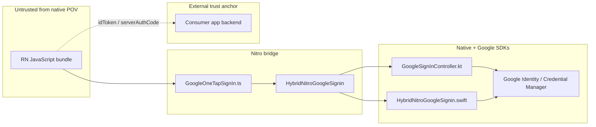

# Architecture Summary — react-native-nitro-google-signin

**Audit target:** `/Users/rutvik/Documents/Projects/Private/packages/google-signin`  
**Audit run:** `run-1` (no prior runs)  
**Date:** 2026-06-29

## Application type

**react-native-nitro-google-signin** is an open-source **npm library** (not a standalone app) that exposes Google Universal / One Tap Sign-In to React Native and Expo dev-client apps. It bridges JavaScript to native Google identity APIs via **Nitro Modules** (JSI).

| Layer | Technology |
|-------|------------|
| Public API | TypeScript (`GoogleOneTapSignIn`, `GoogleSignInButton`) |
| Bridge | Nitro HybridObject `NitroGoogleSignin` |
| Android | Kotlin, AndroidX Credential Manager, Google Identity, AuthorizationClient |
| iOS | Swift, Google Sign-In SDK (`GIDSignIn` ~9.x) |
| Expo | `@expo/config-plugins` plugin (`plugin/withNitroGoogleSignIn.js`) |

## Comparable baseline

Primary comparable: **`@react-native-google-signin/google-signin`** — same trust model (client acquires tokens, backend verifies JWTs). This library uses Credential Manager on Android (Google's current path) and adds nonce support. Security tradeoffs are equivalent: no in-library JWT verification, session reuse on iOS, OAuth scopes gated by Google consent UI.

## Trust model

| Actor | Trust level | Capabilities by design |
|-------|-------------|------------------------|
| Any JS in app process | Untrusted | Can call all library APIs, pass arbitrary `scopes`, `webClientId`, `nonce` |
| End user | Trusted via Google UI | Consent screens, account picker |
| Google SDKs | Trusted | Issue `idToken`, `serverAuthCode` after user consent |
| Consumer backend | Must verify | JWT signature, `aud`, `iss`, `exp`, `nonce`, `hd` |

**No authentication of API callers.** No RBAC. No inbound network surface.

## Input surfaces

| Surface | Entry | Handler |
|---------|-------|---------|
| JS API | `GoogleOneTapSignIn.*` | `src/GoogleOneTapSignIn.ts` → hybrid |
| Configure params | `webClientId`, `scopes`, `nonce`, `hostedDomain`, … | `GoogleSignInController.kt`, `HybridNitroGoogleSignin.swift` |
| Google credential callback | Credential Manager / GIDSignIn | `parseCredential()`, `success(from:)` |
| OAuth activity result | `onActivityResult` | `GoogleSignInAuthorizationHelper.kt` |
| Build-time config | `google-services.json`, plist | `resolveWebClientId()`, Expo plugin |
| Touch events | Sign-in button | `HybridGoogleSignInButton.kt/.swift` |

## Dangerous sinks (library scope)

| Sink | File | Mitigation |
|------|------|------------|
| `idToken` / `serverAuthCode` to JS | Controller, Swift hybrid | Tokens from Google SDK only; backend must verify |
| JWT payload decode (no sig verify) | `IdTokenClaims.kt` | Only after `GoogleIdTokenCredential.createFrom()` |
| EncryptedSharedPreferences | `GoogleSignInController.kt` | AES256-GCM; app-private storage |
| OAuth scopes passthrough | Authorization helper, Swift | Google consent + client registration |
| Profile photo URL to JS | Controller, Swift | Google-issued URLs only |

## Key entry points

| Role | Path |
|------|------|
| Public export | `src/index.ts` |
| Main API | `src/GoogleOneTapSignIn.ts` |
| Nitro spec | `src/specs/nitro-google-signin.nitro.ts` |
| Android controller | `android/src/main/java/com/nitrogooglesignin/GoogleSignInController.kt` |
| Android OAuth | `android/src/main/java/com/nitrogooglesignin/GoogleSignInAuthorizationHelper.kt` |
| Android JWT parse | `android/src/main/java/com/nitrogooglesignin/IdTokenClaims.kt` |
| iOS hybrid | `ios/HybridNitroGoogleSignin.swift` |
| Expo plugin | `plugin/withNitroGoogleSignIn.js` |
| Button hook | `src/hooks/useGoogleSignInFromButton.ts` |

## Prior runs

None. Recommend re-running the audit after major API or native SDK changes; single runs typically cover ~50% of possible issues per skill methodology.
